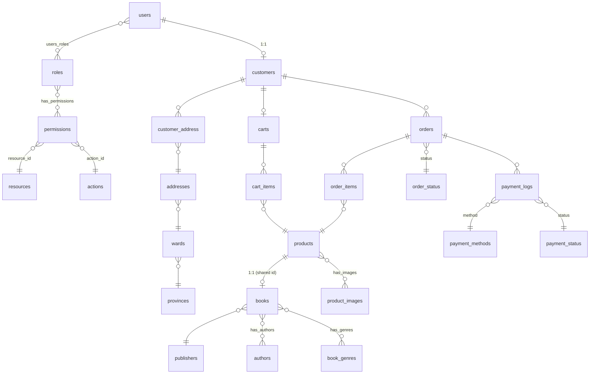

# ERD — Bookify

Documentation for the system’s data model (Entity Relationship Diagram). The full diagram is in:

- [overview.png](./overview.png)

## Overview

The schema is grouped by **business modules**: authorization, users, customers, addresses, products & books, shopping cart, orders, and payments. Bridge tables support **many-to-many** relationships or attach extra attributes to an association.

## High-level diagram (Mermaid)

## 1. Authorization

| Table | Description |
|-------|-------------|
| `resources` | Protected resources (e.g. modules or features). |
| `actions` | Operations on a resource (read, write, etc.). |
| `permissions` | Unique `(resource_id, action_id)` pair — a concrete permission. |
| `roles` | User roles. |
| `has_permissions` | Role–permission assignments (N:N between `roles` and `permissions`). |
| `users_roles` | User–role assignments (N:N between `users` and `roles`). |

**`permissions`**

| Column | Type | Notes |
|--------|------|-------|
| `id` | INTEGER, PK | |
| `resource_id` | VARCHAR(50), FK → `resources.id`, U | Together with `action_id`, enforces a business-level unique permission |
| `action_id` | VARCHAR(50), FK → `actions.id`, U | |

**`resources`**, **`actions`**: `id` (PK, VARCHAR(50)), `name` (VARCHAR(50)).

**`roles`**: `id` (PK, VARCHAR(50)), `name` (VARCHAR(50)).

## 2. User management

**`users`**

| Column | Type | Notes |
|--------|------|-------|
| `id` | VARCHAR(50), PK | |
| `first_name` | VARCHAR(100) | |
| `last_name` | VARCHAR(100) | |
| `email` | VARCHAR(50), U | |
| `gender` | VARCHAR(50) | |
| `hashed_password` | VARCHAR(255) | |

## 3. Customer management

**`customers`**

| Column | Type | Notes |
|--------|------|-------|
| `id` | VARCHAR(50), PK | |
| `user_id` | VARCHAR(50), FK → `users.id` | **1:1** with `users` |
| `phone_number` | VARCHAR(50) | |

**`customer_address`** (customer ↔ address; a customer may have many addresses)

| Column | Type | Notes |
|--------|------|-------|
| `customer_id` | VARCHAR(50), PK, FK | → `customers.id` |
| `address_id` | INTEGER, PK, FK | → `addresses.id` |
| `is_default` | BOOLEAN | Default shipping / billing address flag |
| `recipient_name` | VARCHAR(255) | |
| `recipient_phone` | VARCHAR(50) | |

## 4. Address hierarchy (province / ward)

**`provinces`**: `id` (INTEGER, PK), `code` (U, VARCHAR(50)), `name` (VARCHAR(50)).

**`wards`**: `id` (INTEGER, PK), `code` (U, VARCHAR(50)), `name` (VARCHAR(50)), `province_id` (FK → `provinces.id`).

**`addresses`**: `id` (INTEGER, PK), `street` (VARCHAR(255)), `ward_id` (FK → `wards.id`).

Hierarchy: **province → ward → street-level address**.

## 5. Products & images

**`products`**

| Column | Type | Notes |
|--------|------|-------|
| `id` | INTEGER, PK | |
| `price` | INTEGER | |
| `stock` | INTEGER | |
| `slug` | VARCHAR(50), U | |

**`product_images`**: `id` (INTEGER, PK), `url`, `file_type`.

**`has_images`**: product–image link with `is_main`, `display_order`.

## 6. Books (extension of `products`)

**`books`**: `id` (INTEGER, PK & FK → `products.id`) — **1:1 specialization**: each book is one product with the same primary key. Linked to **`publishers`**.

**`publishers`**: `id`, `name`.

**`authors`**, **`book_genres`**: author and genre entities.

**`has_authors`**, **`has_genres`**: N:N between `books` and `authors` / `book_genres`.

## 7. Shopping cart

**`carts`**: `id`, `customer_id` (FK → `customers.id`) — typically **one cart per customer** in this design.

**`cart_items`**: `cart_id` → `carts`, `product_id` → `products`, `quantity`.

## 8. Orders

**`order_status`**: `id`, `name`.

**`orders`**: `customer_id`, `status` (FK → `order_status.id`), `shipping_address`.

**`order_items`**: `order_id`, `product_id`, `quantity`, `price` (line price at order time).

## 9. Payments

**`payment_methods`**, **`payment_status`**: lookup tables.

**`payment_logs`**: `order_id`, `transaction_id`, `method`, `amount`, `status`.

## Key relationships (summary)

- **User ↔ Customer**: 1:1 via `customers.user_id`.
- **Customer**: many orders, one cart; many addresses via `customer_address`.
- **Product**: referenced by `cart_items` and `order_items`.
- **Book**: specialization of **Product** (same `id`).
- **Address chain**: `provinces` ← `wards` ← `addresses` ← `customer_address`.
- **RBAC**: `users` — `users_roles` — `roles` — `has_permissions` — `permissions` — `resources` / `actions`.

## Implementation notes

- The ERD may be broader than what is currently implemented in the repository; keep migrations and entities aligned with the tables and constraints in the diagram.
- Columns marked `U` in the diagram are **UNIQUE**; `PK` / `FK` denote primary and foreign keys.
